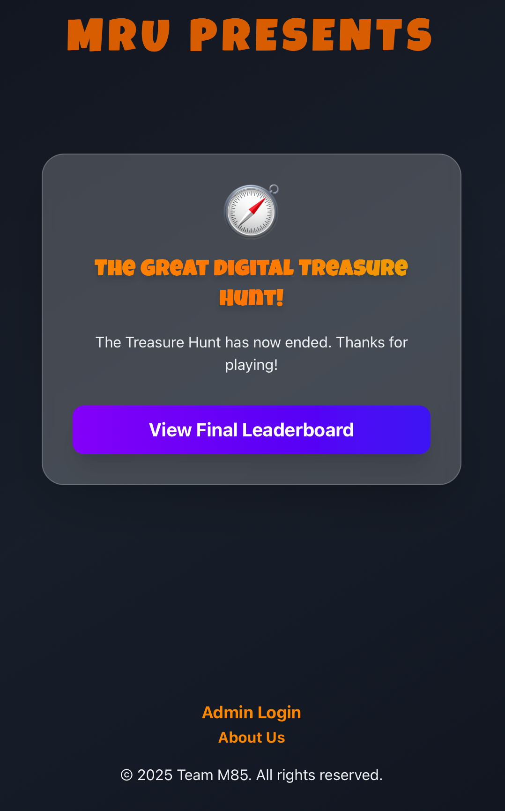
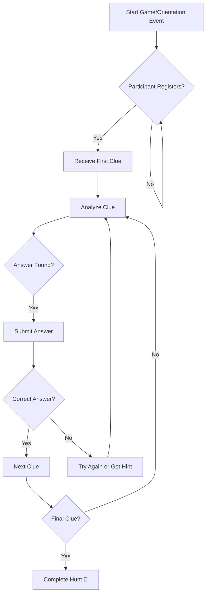

# 🗺️ Treasure Hunt – Manav Rachna Orientation 2025

Welcome to the **Treasure Hunt** project – a dynamic and interactive digital experience built exclusively for **Manav Rachna Orientation 2025**! This application transforms the traditional orientation into an engaging adventure filled with teamwork, critical thinking, and exploration.

New students embark on a journey of discovery through a series of challenging clues and puzzles – all culminating in a fun-filled finale that fosters connection, curiosity, and collaboration.

---

## 🚀 Project Overview

Our mission is to provide a **memorable and immersive experience** that helps students:
- Connect with peers and campus
- Engage through fun and intellectual challenges
- Develop problem-solving and collaboration skills

---

## ✨ Key Features

- **🧩 Interactive Digital Clues** – Presented in diverse formats to challenge observation and logic.
- **🔓 Progressive Clue System** – Unlock the next stage by solving the previous one.
- **👥 Flexible Team Play** – Play solo or collaborate as a team.
- **📈 Real-time Progress Tracking** *(Optional)* – Live tracking of participants.
- **⏱️ Competitive Scoring** *(Optional)* – Race against time to complete all clues.
- **🖥️ Intuitive UI/UX** – Clean and distraction-free gameplay experience.
- **🛠️ Admin Dashboard** *(Optional)* – Organizers can manage clues, track players, reset the game, etc.

---

## 🛠️ Installation & Setup

### 🔧 Prerequisites

Ensure you have the following installed:
- **Node.js** (v16+)
- **npm** or **Yarn**
- **Git**
- **Modern Web Browser** (Chrome, Firefox, Edge)
- *(Optional)* MongoDB / PostgreSQL / Firebase Firestore (depending on your config)

---

### 📦 Clone the Repository

```bash
git clone https://github.com/M85vik/Treasure-Hunt-ManavRachna-Orientation-2025.git
cd Treasure-Hunt-ManavRachna-Orientation-2025
```

---

### 📥 Install Dependencies

```bash
# Using npm
npm install

# OR using Yarn
yarn install
```

---

### ⚙️ Configuration

- **Clue Data**: Modify the file `src/data/clues.json` or `config.js` with your custom clues and answers.
- **Environment Variables**: Create a `.env` file using `.env.example` as a reference.

```env
DB_URI=your_database_connection_string
ADMIN_PASSWORD=your_secure_admin_password
```

- **Participant Settings**: Adjust team or user registration logic if needed.

---

## 🎮 How to Play

### ▶️ Start the App

```bash
npm start
# or
yarn start
```

Open [http://localhost:3000](http://localhost:3000) in your browser.

---

### 👤 Player Journey

1. Register or login with team/individual details
2. Receive the first clue
3. Solve and submit the answer
4. Unlock the next clue upon a correct answer
5. Continue solving clues until the final victory!

---

### 🛠️ Admin Panel

1. Visit: `http://localhost:3000/admin`
2. Login with your credentials
3. Manage game state:
   - Update/view clues
   - Monitor progress
   - Reset data or leaderboard

---

## 📸 Screenshots & Demo

> 📷 Replace the image links below with your actual images or GIFs

### 🧭 Landing Page


---

### 🧩 Clue Interface


---

### 📊 Live Progress / Leaderboard


---

## 📊 Game Flowchart (Mermaid)



---

## 🤝 Contributing

We welcome contributions! Follow these steps:

1. **Fork** the repo
2. **Create a new branch**:

```bash
git checkout -b feature/your-feature-name
```

3. **Make your changes**  
4. **Commit your code**:

```bash
git commit -m "feat: Add leaderboard UI"
```

5. **Push your changes**:

```bash
git push origin feature/your-feature-name
```

6. **Open a Pull Request** on GitHub

---

## 📄 License

This project is licensed under the **MIT License** – see the [LICENSE.md](./LICENSE.md) file for details.

---

© 2025 Manav Rachna International Institute of Research and Studies
